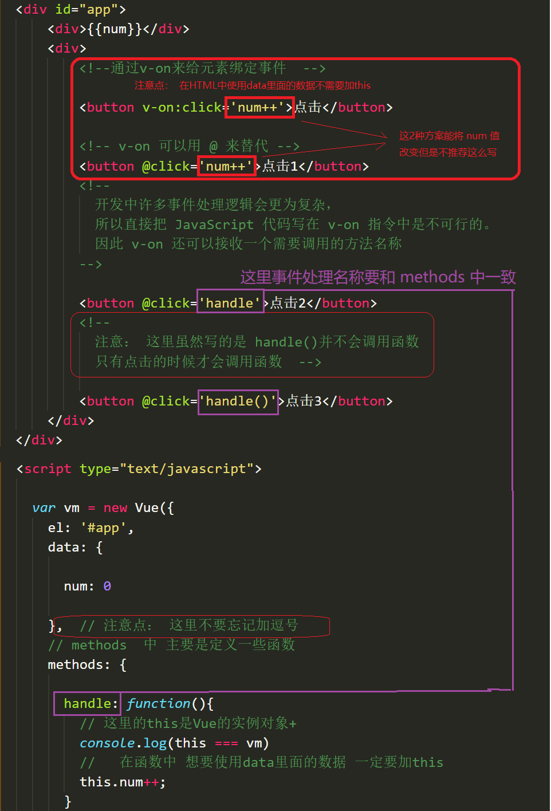

# day01

### Vue 是什么

- **Vue (读音 /vjuː/，类似于 **view**) 是一套用于构建用户界面的渐进式框架**
- vue 的核心库只关注视图层，不仅易于上手，还便于与第三方库或既有项目整合

### Hello World


###  指令

- 本质就是自定义属性

- Vue 中指定都是以 v- 开头 

### v-cloak

- 防止页面加载时出现闪烁问题

```html
<!DOCTYPE html>
<html lang="en">

<head>
    <meta charset="UTF-8">
    <meta name="viewport" content="width=device-width, initial-scale=1.0">
    <title>Document</title>
    <style>
        /* 1、通过属性选择器选择到带有属性 v-cloak的标签让其隐藏 */
        [v-cloak] {
            /* 元素隐藏 */
            display: none;
        }
    </style>

<body>
    <div class="app">
        <!-- 2、让带有插值语法的添加 v-cloak 属性 -->
        <!-- 在数据渲染完场之后，v-cloak 属性会被自动去除，v-cloak一旦移除也就是没有这个属性了  属性选择器就选择不到该标签，也就是对应的标签会变为可见 -->
        <div v-cloak>{{msg}}</div>
    </div>
    <script src="https://cdn.jsdelivr.net/npm/vue/dist/vue.js"></script>
    <script>
        const vm = new Vue({
            el: '#app',
            data: {
                msg: 'Hello Vue'
            }
        });
    </script>
</body>

</html>
```

### v-text

- v-text 指令用于将数据填充到标签中，作用于插值表达式类似，但是没有闪动问题

- 如果数据中有 HTML 标签会将 html 标签一并输出

- 注意：此处为单向绑定，数据对象上的值改变，插值会发生变化；但是当插值发生变化并不会影响数据对象的值

```html
<!DOCTYPE html>
<html lang="en">

<head>
    <meta charset="UTF-8">
    <meta name="viewport" content="width=device-width, initial-scale=1.0">
    <title>Document</title>

<body>
    <div id="app">
        <!-- 注意: 在指令中不要写插值语法  直接写对应的变量名称 -->
        <!-- 例如在 v-text 中赋值的时候不要在写插值语法 -->
        <!-- 一般属性中不加 {{}} 直接写对应的数据名  -->
        <p v-text="msg"></p>
        <p>
            <!-- Vue 中只有在标签的内容中才用插值语法 -->
            {{msg}}
        </p>
    </div>
    <script src="https://cdn.jsdelivr.net/npm/vue/dist/vue.js"></script>
    <script>
        new Vue({
            el: '#app',
            data: {
                msg: 'Hello Vue.js'
            }
        });
    </script>
</body>

</html>
```

### v-html

- 用法和 v-text 相似，但是他可以将 HTML 片段填充到标签中

- 可能有安全问题, 一般只在可信任内容上使用 `v-html`，**永不**用在用户提交的内容上

- 它与 v-text 区别在于 v-text 输出的是纯文本，浏览器不会对其再进行 html 解析，但 v-html 会将其当 html 标签解析后输出

```html
<!DOCTYPE html>
<html lang="en">

<head>
    <meta charset="UTF-8">
    <meta name="viewport" content="width=device-width, initial-scale=1.0">
    <title>Document</title>

<body>
    <div id="app">
        <!-- 输出 => html 标签在渲染的时候被解析 -->
        <p v-html="html"></p>
        <!-- 输出 => <span>通过双括号绑定</span> -->
        <p>{{message}}</p>
        <!-- 输出 => <span>html标签在渲染的时候被源码输出</span> -->
        <p v-text="text"></p>
    </div>
    <script src="https://cdn.jsdelivr.net/npm/vue/dist/vue.js"></script>
    <script>
        const app = new Vue({
            el: "#app",
            data: {
                html: "<span>html标签在渲染的时候被解析</span>",
                message: "<span>通过双括号绑定</span>",
                text: "<span>html标签在渲染的时候被源码输出</span>",
            }
        });
    </script>
</body>

</html>
```

### v-pre

- 显示原始信息跳过编译过程

- 跳过这个元素和它的子元素的编译过程

- **一些静态的内容不需要编译加这个指令可以加快渲染**

```html
<!DOCTYPE html>
<html lang="en">

<head>
    <meta charset="UTF-8">
    <meta name="viewport" content="width=device-width, initial-scale=1.0">
    <title>Document</title>

<body>
    <div id="app">
        <!-- 显示的是{{ this will not be compiled }}  -->
        <span v-pre>{{ this will not be compiled }}</span>
        <!-- 即使 data 里面定义了 msg 这里仍然显示的是 {{msg}}  -->
        <span v-pre>{{msg}}</span> 
    </div>
    <script src="https://cdn.jsdelivr.net/npm/vue/dist/vue.js"></script>
    <script>
        const app = new Vue({
            el: '#app',
            data: {
                msg: 'Hello Vue.js'
            }
        });
    </script>
</body>

</html>
```

### **v-once**

- 执行一次性的插值【当数据改变时，插值处的内容不会继续更新】

```html
<div id="app">
    <!-- 即使 data 里面定义的 msg 后期我们修改了，仍然显示的是第一次 data 里面存储的数据即 Hello Vue.js  -->
    <span v-once>{{ msg}}</span>
</div>
<script src="https://cdn.jsdelivr.net/npm/vue/dist/vue.js"></script>
<script>
    const app = new Vue({
        el: '#app',
        data: {
            msg: 'Hello Vue.js'
        }
    });
</script>
```

### 双向数据绑定

- 当数据发生变化的时候，视图也就发生变化

- 当视图发生变化的时候，数据也会跟着同步变化

- **v-model** 是一个指令，限制在 `<input>、<select>、<textarea>、components` 中使用

```html
<div id="app">
    <div>{{msg}}</div>
    当输入框中内容改变的时候，页面上的msg 会自动更新
    <div>
        <input type="text" v-model='msg'>
    </div>
</div>
<script src="https://cdn.jsdelivr.net/npm/vue/dist/vue.js"></script>
<script>
    const app = new Vue({
        el: '#app',
        data: {
            msg: 'Hello Vue.js'
        }
    });
</script>
```

### mvvm

- MVC 是后端的分层开发概念；MVVM 是前端视图层的概念，主要关注于视图层分离，也就是说：MVVM把前端的视图层，分为了三部分 Model, View , VM ViewModel
- m: model，数据层
    - Vue 中数据层都放在 data 里面
- v: view，视图
  - 即我们的 HTML 界面
- vm:（view-model）控制器，将数据和视图层建立联系      
  - Vue 的实例就是 vm  

### v-on

- 用来绑定事件的

- 形式如：v-on:click，缩写为 @click



### v-on 事件函数中传入参数

```html
<div id="app">
    <div>{{num}}</div>
    <div>
        <!-- 如果事件直接绑定函数名称，那么默认会传递事件对象作为事件函数的第一个参数 -->
        <button v-on:click='handle1'>点击1</button>
        <!-- 如果事件绑定函数调用，那么事件对象必须作为最后一个参数显示传递，并且事件对象的名称必须是 $event -->
        <button v-on:click='handle2(123, 456, $event)'>点击2</button>
    </div>
</div>
<script src="https://cdn.jsdelivr.net/npm/vue/dist/vue.js"></script>
<script>
    const vm = new Vue({
        el: '#app',
        data: {
            num: 0
        },
        methods: {
            handle1: function (event) {
                console.log(event.target.innerHTML)
            },
            handle2: function (p, p1, event) {
                console.log(p, p1)
                console.log(event.target.innerHTML)
                this.num++;
            }
        }
    });
</script>
```

### 事件修饰符

- 在事件处理程序中调用 `event.preventDefault()` 或 `event.stopPropagation()` 是非常常见的需求

- Vue 不推荐我们操作 DOM，为了解决这个问题，Vue.js 为 `v-on` 提供了**事件修饰符**

- 修饰符是由点开头的指令后缀来表示的

```html
<!-- 阻止单击事件继续传播 -->
<a v-on:click.stop="doThis"></a>

<!-- 提交事件不再重载页面 -->
<form v-on:submit.prevent="onSubmit"></form>

<!-- 修饰符可以串联，即阻止冒泡也阻止默认事件 -->
<a v-on:click.stop.prevent="doThat"></a>

<!-- 只有当前元素触发的才会执行，例如通过冒泡触发的就不会执行 -->
<div v-on:click.self="doThat">...</div>
```

```
@click.self.prevent，默认行为可以被儿子触发

@click.prevent.self，默认行为将不会被触发（无论是点击自己还是点击儿子）
```

```html
<!DOCTYPE html>
<html lang="en">

<head>
    <meta charset="UTF-8">
    <meta name="viewport" content="width=device-width, initial-scale=1.0">
    <title>Document</title>
    <style>
        #app div,
        #app a {
            display: block;
            padding: 10px;
            border: 1px dashed red;
        }
    </style>

<body>
    <div id="app">
        <div @click="handleClick('yeye')" href="#">
            yeye
            <a @click.prevent.self="handleClick('baba')" href="javascript:console.log('我是默认行为');">
                baba
                <div @click="handleClick('erzi')">erzi</div>
            </a>
        </div>
    </div>
    <script src="https://cdn.jsdelivr.net/npm/vue/dist/vue.js"></script>
    <script src="https://cdn.jsdelivr.net/npm/vue-router@3.4.3/dist/vue-router.min.js"></script>
    <script src="https://unpkg.com/vuex@3.5.1/dist/vuex.js"></script>
    <script>
        const vm = new Vue({
            el: '#app',
            data: {

            },
            methods: {
                handleClick(con) {
                    console.log(con);
                }
            }
        });
    </script>
</body>

</html>
```

### 按键修饰符

- 在做项目中有时会用到键盘事件，在监听键盘事件时，我们经常需要检查详细的按键。Vue 允许为 `v-on` 在监听键盘事件时添加按键修饰符

```html
<!-- 只有在 `keyCode` 是 13 时调用 `vm.submit()` -->
<input v-on:keyup.13="submit">

<!-- -当点击 enter 时调用 `vm.submit()` -->
<input v-on:keyup.enter="submit">

<!--当点击 enter 或者 space 时调用 `vm.alertMe()`  -->
<input type="text" v-on:keyup.enter.space="alertMe" >

const vm = new Vue({
    el: '#app',
    methods: {
        submit: function () { },
        alertMe: function () { },
    }
});
```

**常用的按键修饰符**

- .enter => enter 键
- .tab => tab键
- .delete (捕获“删除”和“退格”按键) => 删除键
- .esc => 取消键
- .space => 空格键
- .up => 上
- .down => 下
- .left => 左
- .right => 右

### 自定义按键修饰符别名

- 在 Vue 中可以通过 `Vue.config.keyCodes` 自定义按键修饰符别名

```html
<!DOCTYPE html>
<html lang="en">

<head>
    <meta charset="UTF-8">
    <meta name="viewport" content="width=device-width, initial-scale=1.0">
    <title>Document</title>

<body>
    <div id="app">
        <!-- 预先定义了 keycode 116（即 F5）的别名为 F5，因此在文字输入框中按下 F5，会触发 prompt 方法 -->
        <input type="text" v-on:keydown.F5="prompt()">
        <input type="text" v-on:keydown.keydownf5="prompt()">
    </div>
    <script src="https://cdn.jsdelivr.net/npm/vue/dist/vue.js"></script>
    <script>
        Vue.config.keyCodes.F5 = 116;
        // 定义的时候不能使用 camelCase（驼峰写法），例如 keydownF5
        Vue.config.keyCodes.keydownf5 = 116;
        const vm = new Vue({
            el: '#app',
            methods: {
                prompt: function () {
                    alert('我是 F5！');
                }
            }
        });
    </script>
</body>

</html>
```

### v-bind

- v-bind 指令被用来响应地更新 HTML 属性

- v-bind:href 可以缩写为 :href

```html
<!-- 绑定一个属性 -->


<!-- 缩写 -->

```

#### 绑定对象

- 我们可以给 v-bind:class 一个对象，以动态地切换 class

- 注意：v-bind:class 指令可以与普通的 class 特性共存

- v-bind 中支持绑定一个对象 

```html
<div id="app">
    <!-- 如果绑定的是一个对象则键为对应的类名，值为对应 data 中的数据 -->
    <!-- HTML最终渲染为 <ul class="box textColor textSize"></ul> -->
    <!-- textColor，textSize 对应的渲染到页面上的 CSS 类名，isColor，isSize 对应 vue data 中的数据，如果为 true 则对应的类名渲染到页面上  -->
    <!-- 当 isColor 和 isSize 变化时，class 列表将相应的更新，例如，将 isSize 改成 false，class 列表将变为 <ul class="box textColor"></ul> -->
    <ul v-bind:class="{textColor:isColor, textSize:isSize}">
        <li>学习Vue</li>
        <li>学习Node</li>
        <li>学习React</li>
    </ul>
</div>
<script src="https://cdn.jsdelivr.net/npm/vue/dist/vue.js"></script>
<script>
    const vm = new Vue({
        el: '#app',
        data: {
            isColor: true,
            isSize: true
        }
    })
</script>
```

#### 绑定数组

```html
<!DOCTYPE html>
<html lang="en">

<head>
    <meta charset="UTF-8">
    <meta name="viewport" content="width=device-width, initial-scale=1.0">
    <title>Document</title>
    <style>
        .box {
            border: 1px dashed #f0f;
        }

        .textColor {
            color: #f00;
            background-color: #eef;
        }

        .textSize {
            font-size: 30px;
            font-weight: bold;
        }
    </style>

<body>
    <div id="app">
        <!-- v-bind 中支持绑定一个数组 数组中 classA 和 classB 对应为 data 中的数据 -->
        <!-- 这里的 classA 对用 data 中的 classA -->
        <!-- 这里的 classB 对用 data 中的 classB -->
        <ul class="box" :class="[classA, classB]">
            <li>学习Vue</li>
            <li>学习Node</li>
            <li>学习React</li>
        </ul>
    </div>
    <script src="https://cdn.jsdelivr.net/npm/vue/dist/vue.js"></script>
    <script>
        const vm = new Vue({
            el: '.box',
            data: {
                classA: 'textColor',
                classB: 'textSize'
            }
        });
    </script>
</body>

</html>
```

#### 绑定对象和绑定数组的区别

- 绑定对象的时候，对象的属性名为要渲染的类名，对象的属性值对应的是 data 中的数据 

- 绑定数组的时候数组里面存的是 data 中的数据

#### 绑定 style

```html
<!DOCTYPE html>
<html lang="en">

<head>
    <meta charset="UTF-8">
    <meta name="viewport" content="width=device-width, initial-scale=1.0">
    <title>Document</title>

<body>
    <div id="app">
        <div v-bind:style="styleObject">绑定样式对象</div>

        <!-- CSS 属性名可以用驼峰式 (camelCase) 或短横线分隔(例如 'font-size')    -->
        <div v-bind:style="{ color: activeColor, fontSize: fontSize }">内联样式</div>

        <!-- 数组语法可以将多个样式对象应用到同一个元素 -->
        <div v-bind:style="[styleObj1, styleObj2]">hello</div>
    </div>
    <script src="https://cdn.jsdelivr.net/npm/vue/dist/vue.js"></script>
    <script>
        const vm = new Vue({
            el: '#app',
            data: {
                styleObject: {
                    color: 'green',
                    fontSize: '30px',
                    background: 'red'
                },
                activeColor: 'green',
                fontSize: "30px",
                styleObj1: {
                    color: 'red'
                },
                styleObj2: {
                    fontSize: '30px'
                }
            }
        });
    </script>
</body>

</html>
```

### 分支结构

#### v-if 使用场景

- 多个元素通过条件判断展示或者隐藏某个元素。或者多个元素

- 进行两个视图之间的切换

```html
<div id="app">
    <!-- 判断是否加载，如果为真，就加载，否则不加载 -->
    <span v-if="flag">
        如果flag为true则显示,false不显示!
    </span>
</div>
<script src="https://cdn.jsdelivr.net/npm/vue/dist/vue.js"></script>
<script>
    const vm = new Vue({
        el: '#app',
        data: {
            flag: true
        }
    });
</script>
```

```html
<div id="app">
    <div v-if="type === 'A'">
        A
    </div>
    <!-- v-else-if 紧跟在 v-if 或 v-else-if 之后，表示 v-if 条件不成立时执行 -->
    <div v-else-if="type === 'B'">
        B
    </div>
    <div v-else-if="type === 'C'">
        C
    </div>
    <!-- v-else 紧跟在 v-if或 v-else-if 之后 -->
    <div v-else>
        Not A/B/C
    </div>
</div>
<script src="https://cdn.jsdelivr.net/npm/vue/dist/vue.js"></script>
<script>
    const vm = new Vue({
        el: '#app',
        data: {
            type: 'C'
        }
    });
</script>
```

#### v-show 和 v-if的区别

- v-show 本质就是标签 display 设置为 none，控制隐藏
  - v-show 只编译一次，后面其实就是控制 css，而 v-if 不停的销毁和创建，故 v-show 性能更好一点
- v-if 是动态的向 DOM 树内添加或者删除 DOM 元素
  - v-if 切换有一个局部编译/卸载的过程，切换过程中会销毁和重建内部的事件监听和子组件

### 循环结构

#### v-for

- 用于循环的数组里面的值可以是对象，也可以是普通元素  

```html
<div id="app">
    <ul>
        <li v-for="item in items">
            {{ item.message }}
        </li>

    </ul>
</div>
<script src="https://cdn.jsdelivr.net/npm/vue/dist/vue.js"></script>
<script>
    const vm = new Vue({
        el: '#app',
        data: {
            items: [
                { message: 'Foo' },
                { message: 'Bar' }
            ]
        }
    });
</script>
```

- **不推荐**同时使用 `v-if` 和 `v-for`
- 当 `v-if` 与 `v-for` 一起使用时，`v-for` 具有比 `v-if` 更高的优先级（即每次边执行循环再边判断）

```html
<div id="app">
    <!-- v 代表 对象的 value -->
    <!-- k 代表对象的键 -->
    <!-- i 代表索引 -->
    <div v-if='v==13' v-for='(v,k,i) in obj' :key="k">{{v + '---' + k + '---' + i}}</div>
</div>
<script src="https://cdn.jsdelivr.net/npm/vue/dist/vue.js"></script>
<script>
    const vm = new Vue({
        el: '#app',
        data: {
            obj: {
                uname: 'zhangsan',
                age: 13,
                gender: 'female'
            }
        }
    });
</script>
```

- key 的作用，每个节点做一个唯一标识，为了高效的更新虚拟 DOM

### 案例选项卡

#### 1、HTML 结构

```html
<div id="app">
    <div class="tab">
        <!--  tab栏  -->
        <ul>
            <li class="active">apple</li>
            <li class="">orange</li>
            <li class="">lemon</li>
        </ul>
        <!--  对应显示的图片 -->
        <div class="current"></div>
        <div class=""></div>
        <div class=""></div>
    </div>
</div>
```

#### 2、提供的数据

```js
list: [{
    id: 1,
    title: 'apple',
    path: 'img/apple.png'
}, {
    id: 2,
    title: 'orange',
    path: 'img/orange.png'
}, {
    id: 3,
    title: 'lemon',
    path: 'img/lemon.png'
}]
```

#### 3、把数据渲染到页面

把 tab 栏 中的数替换到页面上，把 data 中 title  利用 v-for 循环渲染到页面上；把 data 中 path 利用 v-for 循环渲染到页面上

```html
<div id="app">
    <div class="tab">
        <ul>
            <!--  
                1、绑定key的作用 提高Vue的性能 
                2、 key 需要是唯一的标识 所以需要使用 id，也可以使用 index，index 也是唯一的 
                3、 item 是数组中对应的每一项  
                4、 index 是每一项的索引
            -->
            <li :key='item.id' v-for='(item,index) in list'>{{item.title}}</li>
        </ul>
        <div :key='item.id' v-for='(item, index) in list'>
            <!-- :  是 v-bind 的简写   绑定属性使用 v-bind -->
            
        </div>
    </div>
</div>
```

#### 4、给每一个tab栏添加事件,并让选中的高亮

- 4.1 、让默认的第一项 tab 栏高亮，通过添加类名 active 来实现

    - 在 data 中定义一个默认的索引 currentIndex 为 0

    - 通过动态绑定 class 来比较每一个 li 的索引 和 currentIndex 的值是否相等，如果相等则添加类名 active，否则添加空类名

- 4.2、让默认的第一项 tab 栏对应的 div 显示 

    - 实现思路和第一个 tab 实现思路一样，只不过这里控制第一个 div 显示的类名是 current

```html
<div id="app">
    <div class="tab">
        <ul>
            <!--  
                1、绑定key的作用 提高Vue的性能 
                2、 key 需要是唯一的标识 所以需要使用 id，也可以使用 index，index 也是唯一的 
                3、 item 是数组中对应的每一项  
                4、 index 是每一项的索引
            -->
            <!-- <li :key='item.id' :class="{active: index===currentIndex}" v-for='(item,index) in list'>{{item.title}}</li> -->
            <li :key='item.id' :class="index===currentIndex ? 'active' : ''" v-for='(item,index) in list'>{{item.title}}</li>
        </ul>
        <div :key='item.id' :class="index===currentIndex ? 'current' : ''" v-for='(item, index) in list'>
            <!-- :  是 v-bind 的简写   绑定属性使用 v-bind -->
            
        </div>
    </div>
</div>
```

- 4.3 、点击每一个 tab 栏，当前的高亮，其他的取消高亮 

    - 给每一个 li 添加点击事件，传递当前 index，并赋值给 currentIndex

```html
<!DOCTYPE html>
<html lang="en">

<head>
    <meta charset="UTF-8">
    <meta name="viewport" content="width=device-width, initial-scale=1.0">
    <title>Document</title>
    <style>
        .active {
            color: red;
        }

        .tab div {
            display: none;
        }

        .tab .current {
            display: block;
        }
    </style>

<body>
    <div id="app">
        <div class="tab">
            <ul>
                <!--  
                    1、绑定key的作用 提高Vue的性能 
                    2、 key 需要是唯一的标识 所以需要使用 id，也可以使用 index，index 也是唯一的 
                    3、 item 是数组中对应的每一项  
                    4、 index 是每一项的索引
                -->
                <li :key='item.id' :class="index===currentIndex ? 'active' : ''" v-for='(item,index) in list'
                    @click="change(index)">
                    {{item.title}}</li>
            </ul>
            <div :key='item.id' :class="index===currentIndex ? 'current' : ''" v-for='(item, index) in list'>
                <!-- :  是 v-bind 的简写   绑定属性使用 v-bind -->
                
            </div>
        </div>
    </div>
    <script src="https://cdn.jsdelivr.net/npm/vue/dist/vue.js"></script>
    <script>
        const vm = new Vue({
            el: '#app',
            data: {
                list: [{
                    id: 1,
                    title: 'apple',
                    path: 'img/apple.png'
                }, {
                    id: 2,
                    title: 'orange',
                    path: 'img/orange.png'
                }, {
                    id: 3,
                    title: 'lemon',
                    path: 'img/lemon.png'
                }],
                currentIndex: 0
            },
            methods: {
                change(index) {
                    this.currentIndex = index;
                }
            },
        });
    </script>
</body>

</html>
```