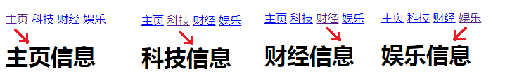
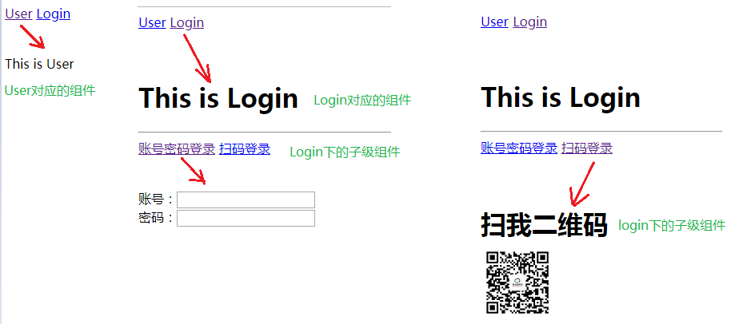
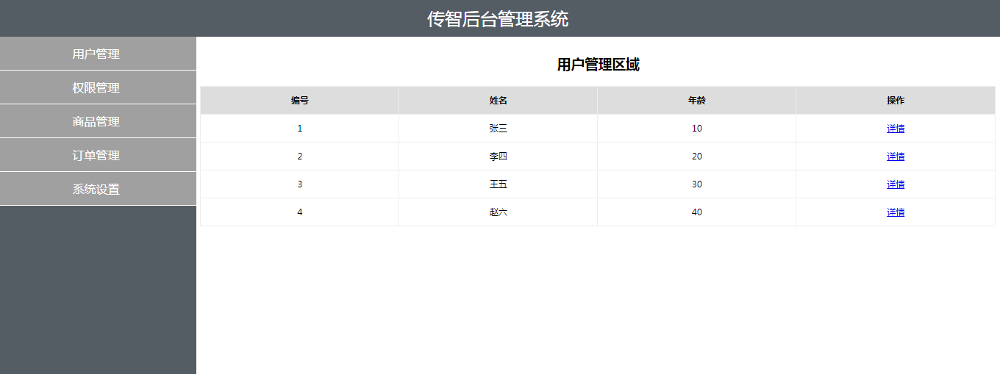

## 今日目标

1.能够说出什么是路由 
2.能够说出前端路由的实现原理
3.能够使用Vue-Router实现前端路由
4.能够实现嵌套路由，动态路由  
5.能够实现命名路由以及编程式导航 
6.理解并实现后台管理案例

## 1.路由的概念

路由的本质就是一种对应关系，比如说我们在url地址中输入我们要访问的url地址之后，浏览器要去请求这个url地址对应的资源。

那么url地址和真实的资源之间就有一种对应的关系，就是路由。

路由分为前端路由和后端路由
1).后端路由是由服务器端进行实现，并完成资源的分发
2).前端路由是依靠hash值(锚链接)的变化进行实现 

后端路由性能相对前端路由来说较低，所以，我们接下来主要学习的是前端路由
前端路由的基本概念：根据不同的事件来显示不同的页面内容，即事件与事件处理函数之间的对应关系
前端路由主要做的事情就是监听事件并分发执行事件处理函数

## 2.前端路由的初体验

前端路由是基于hash值的变化进行实现的（比如点击页面中的菜单或者按钮改变URL的hash值，根据hash值的变化来控制组件的切换）

核心实现依靠一个事件，即监听 hash 值变化的事件

```javascript
window.onhashchange = function(){
    //location.hash可以获取到最新的hash值
    location.hash
}
```

前端路由实现tab栏切换：

```html
<!DOCTYPE html>
<html lang="en">

<head>
    <meta charset="UTF-8">
    <meta name="viewport" content="width=device-width, initial-scale=1.0">
    <title>Document</title>

<body>
    <div id="app">
        <!-- 切换组件的超链接 -->
        <a href="#/zhuye">主页</a>
        <a href="#/keji">科技</a>
        <a href="#/caijing">财经</a>
        <a href="#/yule">娱乐</a>

        <!-- 根据 :is 属性指定的组件名称，把对应的组件渲染到 component 标签所在的位置 -->
        <!-- 可以把 component 标签当做是【组件的占位符】 -->
        <component :is="comName"></component>
    </div>
    <script src="https://cdn.jsdelivr.net/npm/vue/dist/vue.js"></script>
    <script>
        // #region 定义需要被切换的 4 个组件
        // 主页组件
        const zhuye = {
            template: '<h1>主页信息</h1>'
        }

        // 科技组件
        const keji = {
            template: '<h1>科技信息</h1>'
        }

        // 财经组件
        const caijing = {
            template: '<h1>财经信息</h1>'
        }

        // 娱乐组件
        const yule = {
            template: '<h1>娱乐信息</h1>'
        }
        // #endregion

        // #region vue 实例对象
        const vm = new Vue({
            el: '#app',
            data: {
                comName: 'zhuye'
            },
            // 注册私有组件
            components: {
                zhuye,
                keji,
                caijing,
                yule
            }
        })
        // #endregion

        // 监听 window 的 onhashchange 事件，根据获取到的最新的 hash 值，切换要显示的组件的名称
        window.onhashchange = function () {
            // 通过 location.hash 获取到最新的 hash 值
            console.log(location.hash);
            switch (location.hash.slice(1)) {
                case '/zhuye':
                    vm.comName = 'zhuye'
                    break
                case '/keji':
                    vm.comName = 'keji'
                    break
                case '/caijing':
                    vm.comName = 'caijing'
                    break
                case '/yule':
                    vm.comName = 'yule'
                    break
            }
        };
    </script>
</body>

</html>
```

点击每个超链接之后，会进行相应的内容切换，如下：




核心思路：

在页面中有一个vue实例对象，vue实例对象中有四个组件，分别是tab栏切换需要显示的组件内容

在页面中有四个超链接，如下：

```html
<a href="#/zhuye">主页</a> 
<a href="#/keji">科技</a> 
<a href="#/caijing">财经</a>
<a href="#/yule">娱乐</a>
```

当我们点击这些超链接的时候，就会改变 url 地址中的 hash 值，当 hash 值被改变时，就会触发 onhashchange 事件，在触发 onhashchange 事件的时候，我们根据 hash 值来让对应的组件进行显示

```javascript
window.onhashchange = function() {
    // 通过 location.hash 获取到最新的 hash 值
    console.log(location.hash);
    switch(location.hash.slice(1)){
        case '/zhuye':
        // 通过更改数据 comName 来指定显示的组件
        // 因为 <component :is="comName"></component> ，组件已经绑定了comName
            vm.comName = 'zhuye'
        break
        case '/keji':
            vm.comName = 'keji'
        break
        case '/caijing':
            vm.comName = 'caijing'
        break
        case '/yule':
            vm.comName = 'yule'
        break
    }
}
```

## 3.Vue Router简介

它是一个Vue.js官方提供的路由管理器。是一个功能更加强大的前端路由器，推荐使用。

Vue Router 和 Vue.js 非常契合，可以一起方便的实现 SPA(single page web application,单页应用程序)应用程序的开发

Vue Router 依赖于 Vue，所以需要先引入 Vue，再引入 Vue Router

Vue Router的特性：

- 支持H5历史模式或者hash模式
- 支持嵌套路由
- 支持路由参数
- 支持编程式路由
- 支持命名路由
- 支持路由导航守卫
- 支持路由过渡动画特效
- 支持路由懒加载
- 支持路由滚动行为

## 4.Vue Router的使用步骤(★★★)

A.导入js文件

```html
<script src="lib/vue_2.5.22.js"></script>
<script src="lib/vue-router_3.0.2.js"></script>
```

B.添加路由链接: <router-link> 是路由中提供的标签，默认会被渲染为 a 标签，to 属性默认被渲染为 href 属性，to 属性的值会被渲染为 # 开头的 hash 地址

```html
<router-link to="/user">User</router-link>
<router-link to="/login">Login</router-link>
```

C.添加路由填充位（路由占位符）

```html
<router-view></router-view>
```

D.定义路由组件

```javascript
const User = {
    template: '<div>User 的内容</div>'
};
const Login = {
    template: '<div>Login 的内容</div>'
};
```

E.配置路由规则并创建路由实例

```javascript
const router = new VueRouter({
    // 每一个路由规则都是一个对象，对象中至少包含 path 和 component 两个属性
    routes: [
        {
            path: '/user',
            component: User
        },
        {
            path: '/login',
            component: Login
        }
    ] 
});
```

F.将路由挂载到Vue实例中

```javascript
const vm = new Vue({
    el: '#app',
    router,
});
```

小结：

Vue Router的使用步骤还是比较清晰的，按照步骤一步一步就能完成路由操作
A.导入js文件
B.添加路由链接
C.添加路由占位符(最后路由展示的组件就会在占位符的位置显示)
D.定义路由组件
E.配置路由规则并创建路由实例
F.将路由挂载到Vue实例中

补充：
路由重定向：可以通过路由重定向为页面设置默认展示的组件
在路由规则中添加一条路由规则即可，如下：

```javascript
const router = new VueRouter({
    routes: [
        // redirect
        {
            path: '/',
            redirect: '/user'
        },
        {
            path: '/user',
            component: User
        },
        {
            path: '/login',
            component: Login
        }
    ]
});
```

## 5.嵌套路由，动态路由的实现方式

### A.嵌套路由的概念(★★★)

显示的组件中还有新的子级路由链接以及内容，嵌套路由最关键的代码在于理解子级路由的概念：比如我们有一个 /login 的路由，那么 /login 下面还可以添加子级路由，如:

```html
/login/account
/login/phone
```

参考代码如下：

```html
<!DOCTYPE html>
<html lang="en">

<head>
    <meta charset="UTF-8">
    <meta name="viewport" content="width=device-width, initial-scale=1.0">
    <title>Document</title>

<body>
    <div id="app">
        <!-- 入口 -->
        <router-link to="/user">user</router-link>
        <router-link to="/login">login</router-link>
        <!-- 出口 -->
        <router-view></router-view>
    </div>
    <script src="https://cdn.jsdelivr.net/npm/vue/dist/vue.js"></script>
    <script src="https://cdn.jsdelivr.net/npm/vue-router@3.4.3/dist/vue-router.min.js"></script>
    <script src="https://unpkg.com/vuex@3.5.1/dist/vuex.js"></script>
    <script>
        const User = {
            template: '<div>User 的内容</div>'
        };
        const Login = {
            template: `
            <div>
                <div>Login 的内容</div>
                <router-link to="/login/account">账号</router-link>
                <router-link to="/login/phone">手机</router-link>
                <router-view></router-view>
            </div>
            `
        };

        const Account = {
            template: '<div>登录账号</div>'
        };
        const Phone = {
            template: '<div>手机号码</div>'
        };
        const router = new VueRouter({
            routes: [
                // redirect
                {
                    path: '/',
                    redirect: '/user'
                },
                {
                    path: '/user',
                    component: User
                },
                {
                    path: '/login',
                    component: Login,
                    // 通过 children 属性为 /login 添加子路由规则
                    children: [
                        {
                            path: '/login/account',
                            component: Account
                        },
                        {
                            path: '/login/phone',
                            component: Phone
                        }
                    ]
                }
            ]
        });
        const vm = new Vue({
            el: '#app',
            router,
        });
    </script>
</body>

</html>
```

页面效果大致如下：



### B.动态路由匹配(★★★)

```javascript
var User = { template:"<div>用户：{{$route.params.id}}</div>" };

var myRouter = new VueRouter({
    // routes 是路由规则数组
    routes: [
        // 通过/:参数名  的形式传递参数 
        { path: "/user/:id", component: User },
    ]
})
```

补充：

除了 $route.params.id 来获取路由参数，还有下来方式来获取！

1.我们可以通过 props 来接收参数

```javascript
var User = { 
    props:["id"],
    template:"<div>用户：{{id}}</div>"
};

var myRouter = new VueRouter({
    // routes 是路由规则数组
    routes: [
        // 通过/:参数名  的形式传递参数 
        // 如果 props 设置为 true，route.params 将会被设置为组件属性 props
        { path: "/user/:id", component: User,props:true },
        
    ]
})
```

2.还有一种情况，我们可以将 props 设置为对象，那么就直接将对象的数据传递给组件进行使用

```javascript
var User = { 
    props:["username","pwd"],
    template:"<div>用户：{{username}}---{{pwd}}</div>"
};

var myRouter = new VueRouter({
    routes: [
        // 通过/:参数名的形式传递参数 
        // 如果 props 设置为对象，则传递的是对象中的数据给组件
        {
            path: "/user/:id",
            component: User,
            props:{username:"jack",pwd:123}
        },
    ]
});
```

3.如果想要获取传递的参数值还想要获取传递的对象数据，那么 props 应该设置为函数形式

```javascript
var User = { 
    props: ["username","pwd","id"],
    template: "<div>用户：{{id}} -> {{username}}---{{pwd}}</div>"
};

var myRouter = new VueRouter({
    routes: [
        // 通过/:参数名的形式传递参数 
        // 如果 props 设置为函数，则通过函数的第一个参数获取路由对象
        // 并可以通过路由对象的 params 属性获取传递的参数
        {
            path: "/user/:id",
            component: User,
            props:(route)=>{
                return {
                    username:"jack",
                    pwd:123,
                    id:route.params.id
                };
            } 
        },
    ]
});
```

## 7.命名路由以及编程式导航

### A.命名路由：给路由取别名

案例：

```javascript
var myRouter = new VueRouter({
    routes: [
        // 通过 name 属性为路由添加一个别名
        {
            path: "/user/:id",
            component: User,
            name: "user"
        }
    ]
})

// 添加了别名之后，可以使用别名进行跳转
<router-link :to="{ name:'user' , params: {id:123} }">User</router-link>

// 还可以编程式导航
myRouter.push( { name:'user' , params: {id:123} } );
```

### B.编程式导航(★★★)

页面导航的两种方式：

A.声明式导航：通过点击链接的方式实现的导航

B.编程式导航：调用js的api方法实现导航

Vue-Router中常见的导航方式：

```javascript
this.$router.push("/login");
this.$router.push({ name:'user' , params: {id:123} });
this.$router.push({ path:"/login" });
this.$router.push({ path:"/login",query:{username:"jack"} });

this.$router.go(n); // n 为数字，参考 history.go
this.$router.go(-1);
```

## 8.实现后台管理案例(★★★)

案例效果：



点击左侧的"用户管理","权限管理","商品管理","订单管理","系统设置"都会出现对应的组件并展示内容

其中"用户管理"组件展示的效果如上图所示，在用户管理区域中的详情链接也是可以点击的，点击之后将会显示用户详情信息。

希望是通过组件的形式展示页面的主体内容，而不是写死页面结构，所以我们可以先定义一个根组件：

**抽离并渲染 App 跟组件**

```html
<!DOCTYPE html>
<html lang="en">

<head>
    <meta charset="UTF-8" />
    <title>基于vue-router的案例</title>
    <style type="text/css">
        html,
        body,
        #app {
            margin: 0;
            padding: 0px;
            height: 100%;
        }

        .header {
            height: 50px;
            background-color: #545c64;
            line-height: 50px;
            text-align: center;
            font-size: 24px;
            color: #fff;
        }

        .footer {
            height: 40px;
            line-height: 40px;
            background-color: #888;
            position: absolute;
            bottom: 0;
            width: 100%;
            text-align: center;
            color: #fff;
        }

        .main {
            display: flex;
            position: absolute;
            top: 50px;
            bottom: 40px;
            width: 100%;
        }

        .content {
            flex: 1;
            text-align: center;
            height: 100%;
        }

        .left {
            flex: 0 0 20%;
            background-color: #545c64;
        }

        .left a {
            color: white;
            text-decoration: none;
        }

        .right {
            margin: 5px;
        }

        .btns {
            width: 100%;
            height: 35px;
            line-height: 35px;
            background-color: #f5f5f5;
            text-align: left;
            padding-left: 10px;
            box-sizing: border-box;
        }

        button {
            height: 30px;
            background-color: #ecf5ff;
            border: 1px solid lightskyblue;
            font-size: 12px;
            padding: 0 20px;
        }

        .main-content {
            margin-top: 10px;
        }

        ul {
            margin: 0;
            padding: 0;
            list-style: none;
        }

        ul li {
            height: 45px;
            line-height: 45px;
            background-color: #a0a0a0;
            color: #fff;
            cursor: pointer;
            border-bottom: 1px solid #fff;
        }

        table {
            width: 100%;
            border-collapse: collapse;
        }

        td,
        th {
            border: 1px solid #eee;
            line-height: 35px;
            font-size: 12px;
        }

        th {
            background-color: #ddd;
        }
    </style>
</head>

<body>
    <div id="app">
        <!-- 路由出口 -->
        <router-view></router-view>
    </div>
    <script src="https://cdn.jsdelivr.net/npm/vue/dist/vue.js"></script>
    <script src="https://cdn.jsdelivr.net/npm/vue-router@3.4.3/dist/vue-router.min.js"></script>
    <script>
        const App = {
            template: `
            <div>
                <!-- 头部区域 -->
                <header class="header">传智后台管理系统</header>
                <!-- 中间主体区域 -->
                <div class="main">
                    <!-- 左侧菜单栏 -->
                    <div class="content left">
                        <ul>
                            <li>用户管理</li>
                            <li>权限管理</li>
                            <li>商品管理</li>
                            <li>订单管理</li>
                            <li>系统设置</li>
                        </ul>
                    </div>
                    <!-- 右侧内容区域 -->
                    <div class="content right">
                        <div class="main-content">添加用户表单</div>
                    </div>
                </div>
                <!-- 尾部区域 -->
                <footer class="footer">版权信息</footer>
            </div>
            `
        };
        const router = new VueRouter({
            routes: [
                {
                    path: '/',
                    component: App
                }
            ]
        });
        new Vue({
            el: '#app',
            router
        });
    </script>
</body>

</html>
```

**将左侧菜单改造为路由连接**

```html
<ul>
    <li>
        <router-link to="/users">用户管理</router-link>
    </li>
    <li>
        <router-link to="/rights">权限管理</router-link>    
    </li>
    <li>
        <router-link to="/goods">商品管理</router-link>    
    </li>
    <li>
        <router-link to="/orders">订单管理</router-link>    
    </li>
    <li>
        <router-link to="/settings">系统设置</router-link>    
    </li>
</ul>
```

**创建左侧菜单对应的路由组件，并添加路由占位符**

```html
<!DOCTYPE html>
<html lang="en">

<head>
    <meta charset="UTF-8" />
    <title>基于vue-router的案例</title>
    <style type="text/css">
        html,
        body,
        #app {
            margin: 0;
            padding: 0px;
            height: 100%;
        }

        .header {
            height: 50px;
            background-color: #545c64;
            line-height: 50px;
            text-align: center;
            font-size: 24px;
            color: #fff;
        }

        .footer {
            height: 40px;
            line-height: 40px;
            background-color: #888;
            position: absolute;
            bottom: 0;
            width: 100%;
            text-align: center;
            color: #fff;
        }

        .main {
            display: flex;
            position: absolute;
            top: 50px;
            bottom: 40px;
            width: 100%;
        }

        .content {
            flex: 1;
            text-align: center;
            height: 100%;
        }

        .left {
            flex: 0 0 20%;
            background-color: #545c64;
        }

        .left a {
            color: white;
            text-decoration: none;
        }

        .right {
            margin: 5px;
        }

        .btns {
            width: 100%;
            height: 35px;
            line-height: 35px;
            background-color: #f5f5f5;
            text-align: left;
            padding-left: 10px;
            box-sizing: border-box;
        }

        button {
            height: 30px;
            background-color: #ecf5ff;
            border: 1px solid lightskyblue;
            font-size: 12px;
            padding: 0 20px;
        }

        .main-content {
            margin-top: 10px;
        }

        ul {
            margin: 0;
            padding: 0;
            list-style: none;
        }

        ul li {
            height: 45px;
            line-height: 45px;
            background-color: #a0a0a0;
            color: #fff;
            cursor: pointer;
            border-bottom: 1px solid #fff;
        }

        table {
            width: 100%;
            border-collapse: collapse;
        }

        td,
        th {
            border: 1px solid #eee;
            line-height: 35px;
            font-size: 12px;
        }

        th {
            background-color: #ddd;
        }
    </style>
</head>

<body>
    <div id="app">
        <!-- 路由出口 -->
        <router-view></router-view>
    </div>
    <script src="https://cdn.jsdelivr.net/npm/vue/dist/vue.js"></script>
    <script src="https://cdn.jsdelivr.net/npm/vue-router@3.4.3/dist/vue-router.min.js"></script>
    <script>
        const App = {
            template: `
            <div>
                <!-- 头部区域 -->
                <header class="header">传智后台管理系统</header>
                <!-- 中间主体区域 -->
                <div class="main">
                    <!-- 左侧菜单栏 -->
                    <div class="content left">
                        <ul>
                            <li>
                                <router-link to="/users">用户管理</router-link>
                            </li>
                            <li>
                                <router-link to="/rights">权限管理</router-link>    
                            </li>
                            <li>
                                <router-link to="/goods">商品管理</router-link>    
                            </li>
                            <li>
                                <router-link to="/orders">订单管理</router-link>    
                            </li>
                            <li>
                                <router-link to="/settings">系统设置</router-link>    
                            </li>
                        </ul>
                    </div>
                    <!-- 右侧内容区域 -->
                    <div class="content right">
                        <div class="main-content">
                            <router-view></router-view>
                        </div>
                    </div>
                </div>
                <!-- 尾部区域 -->
                <footer class="footer">版权信息</footer>
            </div>
            `
        };
        const Users = {
            template: `
            <div>
                <h3>用户管理</h3>
            </div>
            `
        };
        const Rights = {
            template: `
            <div>
                <h3>权限管理</h3>
            </div>
            `
        };
        const Goods = {
            template: `
            <div>
                <h3>商品管理</h3>
            </div>
            `
        };
        const Orders = {
            template: `
            <div>
                <h3>订单管理</h3>
            </div>
            `
        };
        const Settings = {
            template: `
            <div>
                <h3>系统设置</h3>
            </div>
            `
        };

        const router = new VueRouter({
            routes: [
                {
                    path: '/',
                    component: App,
                    redirect: '/users',
                    children: [
                        {
                            path: '/users',
                            component: Users
                        },
                        {
                            path: '/rights',
                            component: Rights
                        },
                        {
                            path: '/goods',
                            component: Goods
                        },
                        {
                            path: '/orders',
                            component: Orders
                        },
                        {
                            path: '/settings',
                            component: Settings
                        }
                    ]
                }
            ]
        });
        new Vue({
            el: '#app',
            router
        });
    </script>
</body>

</html>
```

**渲染用户列表**

```html
const Users = {
    data() {
        return {
            userlist: [
                {
                    id: 1,
                    name: 'zs',
                    age: 18
                },
                {
                    id: 2,
                    name: 'ls',
                    age: 45
                },
                {
                    id: 3,
                    name: 'zl',
                    age: 33
                },
            ]
        }
    },
    template: `
    <div>
        <h3>用户管理</h3>
        <table>
            <thead>
                <tr>
                    <th>编号</th>
                    <th>姓名</th>
                    <th>年龄</th>
                    <th>操作</th>
                </tr>
            </thead>
            <tbody>
                <tr v-for="item in userlist" :key="item.id">
                    <td>{{item.id}}</td>
                    <td>{{item.name}}</td>
                    <td>{{item.age}}</td>
                    <td><a href="javascript:;">详情</a></td>
                </tr>
            </tbody>
        </table>
    </div>
    `
};
```

**用户详情**

```html
<!DOCTYPE html>
<html lang="en">

<head>
    <meta charset="UTF-8" />
    <title>基于vue-router的案例</title>
    <style type="text/css">
        html,
        body,
        #app {
            margin: 0;
            padding: 0px;
            height: 100%;
        }

        .header {
            height: 50px;
            background-color: #545c64;
            line-height: 50px;
            text-align: center;
            font-size: 24px;
            color: #fff;
        }

        .footer {
            height: 40px;
            line-height: 40px;
            background-color: #888;
            position: absolute;
            bottom: 0;
            width: 100%;
            text-align: center;
            color: #fff;
        }

        .main {
            display: flex;
            position: absolute;
            top: 50px;
            bottom: 40px;
            width: 100%;
        }

        .content {
            flex: 1;
            text-align: center;
            height: 100%;
        }

        .left {
            flex: 0 0 20%;
            background-color: #545c64;
        }

        .left a {
            color: white;
            text-decoration: none;
        }

        .right {
            margin: 5px;
        }

        .btns {
            width: 100%;
            height: 35px;
            line-height: 35px;
            background-color: #f5f5f5;
            text-align: left;
            padding-left: 10px;
            box-sizing: border-box;
        }

        button {
            height: 30px;
            background-color: #ecf5ff;
            border: 1px solid lightskyblue;
            font-size: 12px;
            padding: 0 20px;
        }

        .main-content {
            margin-top: 10px;
        }

        ul {
            margin: 0;
            padding: 0;
            list-style: none;
        }

        ul li {
            height: 45px;
            line-height: 45px;
            background-color: #a0a0a0;
            color: #fff;
            cursor: pointer;
            border-bottom: 1px solid #fff;
        }

        table {
            width: 100%;
            border-collapse: collapse;
        }

        td,
        th {
            border: 1px solid #eee;
            line-height: 35px;
            font-size: 12px;
        }

        th {
            background-color: #ddd;
        }
    </style>
</head>

<body>
    <div id="app">
        <!-- 路由出口 -->
        <router-view></router-view>
    </div>
    <script src="https://cdn.jsdelivr.net/npm/vue/dist/vue.js"></script>
    <script src="https://cdn.jsdelivr.net/npm/vue-router@3.4.3/dist/vue-router.min.js"></script>
    <script>
        const App = {
            template: `
            <div>
                <!-- 头部区域 -->
                <header class="header">传智后台管理系统</header>
                <!-- 中间主体区域 -->
                <div class="main">
                    <!-- 左侧菜单栏 -->
                    <div class="content left">
                        <ul>
                            <li>
                                <router-link to="/users">用户管理</router-link>
                            </li>
                            <li>
                                <router-link to="/rights">权限管理</router-link>    
                            </li>
                            <li>
                                <router-link to="/goods">商品管理</router-link>    
                            </li>
                            <li>
                                <router-link to="/orders">订单管理</router-link>    
                            </li>
                            <li>
                                <router-link to="/settings">系统设置</router-link>    
                            </li>
                        </ul>
                    </div>
                    <!-- 右侧内容区域 -->
                    <div class="content right">
                        <div class="main-content">
                            <router-view></router-view>
                        </div>
                    </div>
                </div>
                <!-- 尾部区域 -->
                <footer class="footer">版权信息</footer>
            </div>
            `
        };
        const Users = {
            data() {
                return {
                    userlist: [
                        {
                            id: 1,
                            name: 'zs',
                            age: 18
                        },
                        {
                            id: 2,
                            name: 'ls',
                            age: 45
                        },
                        {
                            id: 3,
                            name: 'zl',
                            age: 33
                        },
                    ]
                }
            },
            template: `
            <div>
                <h3>用户管理</h3>
                <table>
                    <thead>
                        <tr>
                            <th>编号</th>
                            <th>姓名</th>
                            <th>年龄</th>
                            <th>操作</th>
                        </tr>
                    </thead>
                    <tbody>
                        <tr v-for="item in userlist" :key="item.id">
                            <td>{{item.id}}</td>
                            <td>{{item.name}}</td>
                            <td>{{item.age}}</td>
                            <td><a href="javascript:;" @click="goDetail(item.id)">详情</a></td>
                        </tr>
                    </tbody>
                </table>
            </div>
            `,
            methods: {
                goDetail(id) {
                    this.$router.push('/userinfo/' + id);
                }
            },
        };
        const UserInfo = {
            props: ['id'],
            template: `
            <div>
                <h3>用户详情</h3>
                <div>{{id}}</div>
                <button @click="$router.go(-1)">后退</button>
            </div>
            `
        };
        const Rights = {
            template: `
            <div>
                <h3>权限管理</h3>
            </div>
            `
        };
        const Goods = {
            template: `
            <div>
                <h3>商品管理</h3>
            </div>
            `
        };
        const Orders = {
            template: `
            <div>
                <h3>订单管理</h3>
            </div>
            `
        };
        const Settings = {
            template: `
            <div>
                <h3>系统设置</h3>
            </div>
            `
        };

        const router = new VueRouter({
            routes: [
                {
                    path: '/',
                    component: App,
                    redirect: '/users',
                    children: [
                        {
                            path: '/users',
                            component: Users
                        },
                        {
                            path: '/userinfo/:id',
                            component: UserInfo,
                            props: true
                        },
                        {
                            path: '/rights',
                            component: Rights
                        },
                        {
                            path: '/goods',
                            component: Goods
                        },
                        {
                            path: '/orders',
                            component: Orders
                        },
                        {
                            path: '/settings',
                            component: Settings
                        }
                    ]
                }
            ]
        });
        new Vue({
            el: '#app',
            router
        });
    </script>
</body>

</html>
```