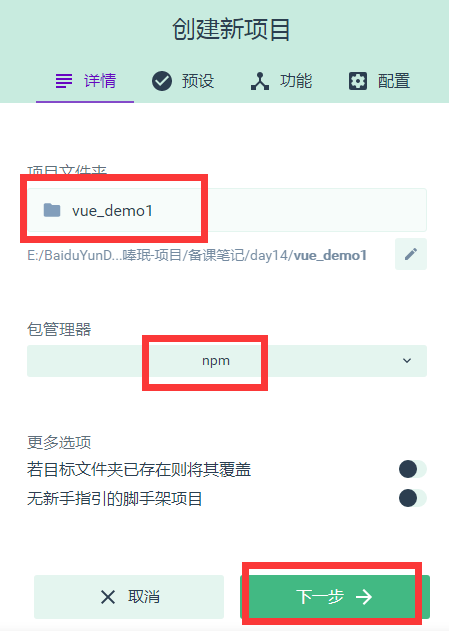
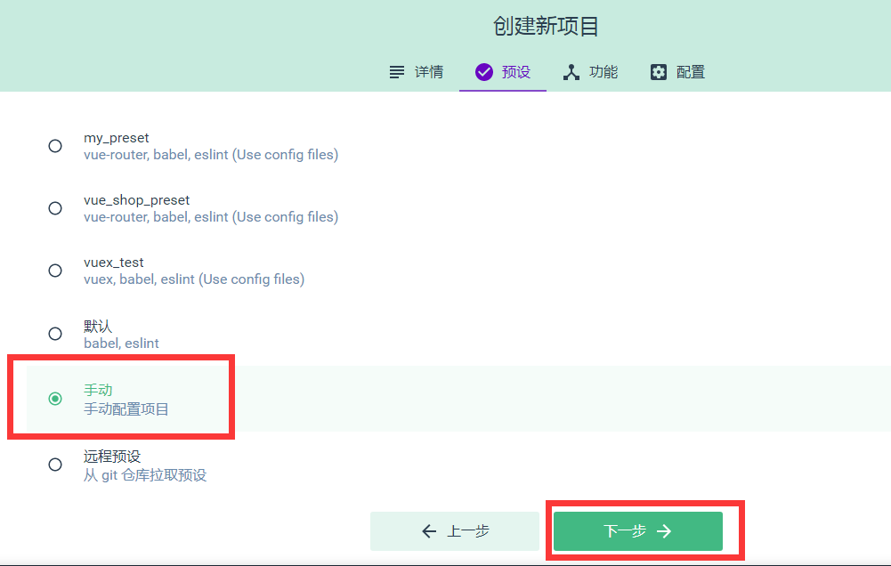
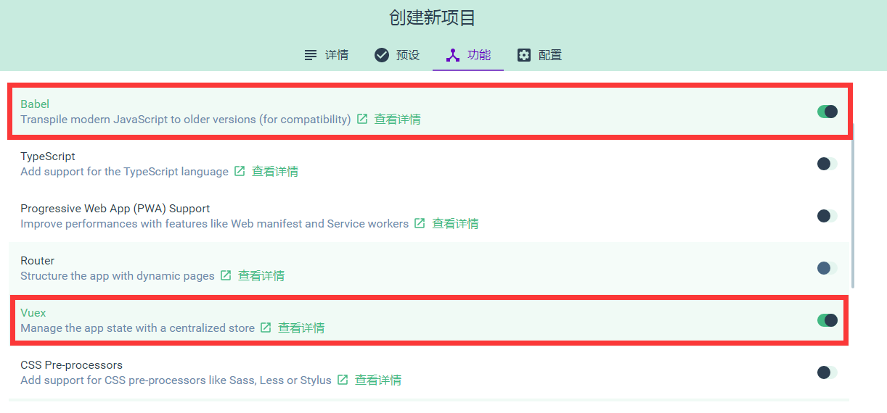
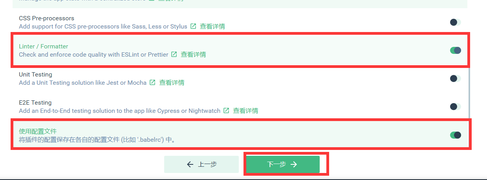
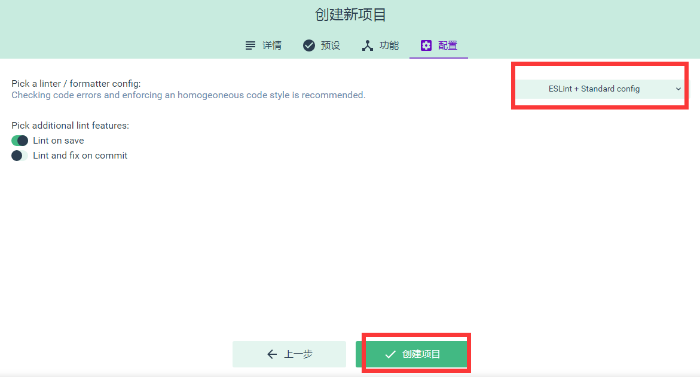

## 今日目标

1. Vuex 概述

2. Vuex 基本使用

3. 使用 Vuex 完成 todo 案例

## 1. Vuex 概述

Vuex 是实现组件全局状态（数据）管理的一种机制，可以方便的实现组件之间的数据共享

使用 Vuex 管理数据的好处：
A. 能够在 vuex 中集中管理共享的数据，便于开发和后期进行维护
B. 能够高效的实现组件之间的数据共享，提高开发效率
C. 存储在 vuex 中的数据是响应式的，当数据发生改变时，页面中的数据也会同步更新

## 2. Vuex 的基本使用

创建带有 vuex 的 vue 项目，打开终端，输入命令：vue ui
当项目仪表盘打开之后，我们点击页面左上角的项目管理下拉列表，再点击 Vue 项目管理器
点击创建项目，如下图所示
第一步，设置项目名称和包管理器

第二步，设置手动配置项目

第三步，设置功能项


第四步，创建项目


1. 安装 Vuex 依赖包

```bash
npm i vuex
```

2. 导入 Vuex 包

```js
import Vuex from 'vuex';
Vue.use(Vuex);
```

3. 创建 store 对象

```javascript
const store = new Vuex.Store({
  // state 中存放的就是全局共享的数据
  state: {
    count: 0,
  },
});
```

4. 将 store 对象挂载到 vue 实例中

```javascript
new Vue({
  el: '#app',
  render: (h) => h(app),
  router,
  // 将创建的共享数据对象，挂载到 Vue 实例中
  // 所有的组件，就可以直接从 store 中获取了
  store,
});
```

## 3. 使用 Vuex 完成计数器案例

打开刚刚创建的 vuex 项目，找到 src 目录中的 `App.vue` 组件，将代码重新编写如下：

```html
<template>
  <div>
    <my-addition></my-addition>
    <p>----------------------------------------</p>
    <my-substraction></my-substraction>
  </div>
</template>

<script>
  import Addition from './components/Addition';
  import Subtraction from './components/Subtraction';

  export default {
    name: 'App',
    components: {
      'my-addition': Addition,
      'my-substraction': Subtraction,
    },
  };
</script>
```

在 components 文件夹中创建 Addition.vue 组件，代码如下：

```html
<template>
  <div>
    <h3>当前最新的count值为：{{$store.state.count}}</h3>
    <button>+1</button>
  </div>
</template>

<script>
  export default {
    data() {
      return {};
    },
  };
</script>

<style></style>
```

在 components 文件夹中创建 Subtraction.vue 组件，代码如下：

```html
<template>
  <div>
    <h3>当前最新的count值为：{{$store.state.count}}</h3>
    <button>-1</button>
  </div>
</template>

<script>
  export default {
    data() {
      return {};
    },
  };
</script>

<style></style>
```

最后在项目根目录(与 src 平级)中创建 .prettierrc 文件，编写代码如下：

```json
{
  "semi": false,
  "singleQuote": true
}
```

## 4. Vuex 中的核心特性

### A. State

State 提供唯一的公共数据源，所有共享的数据都要统一放到 Store 中的 State 中存储，例如，打开项目中的 store.js 文件，在 State 对象中可以添加我们要共享的数据，如：count: 0

在组件中访问 State 的 2 种方式：

1).this.\$store.state. 全局数据名称 如：this.\$store.state.count

2). 先按需导入 mapState 函数： `import { mapState } from 'vuex'`

然后数据映射为计算属性： `computed:{ ...mapState(['全局数据名称']) }`

### B. Mutation

Mutation 用于修改变更 \$store 中的数据，使用方式：打开 store.js 文件，在 mutations 中添加代码如下

```js
mutations: {
    add(state, step) {
        //第一个形参永远都是 state 也就是 $state 对象
        //第二个形参是调用 add 时传递的参数
        state.count += step;
    }
}
```

使用 mutations 的第一种方式：

```html
<button @click="Add">+1</button>
```

```js
methods: {
    Add() {
        // 使用 commit 函数调用 mutations 中的对应函数，
        //第一个参数就是我们要调用的 mutations 中的函数名
        //第二个参数就是传递给 add 函数的参数
        this.$store.commit('add', 10)
    }
}
```

使用 mutations 的第二种方式：

```js
import {
    mapMutations
} from 'vuex'
methods: {
    ...mapMutations(['add']),
    Add() {
        this.add(10)
    }
}
```

### C. Action

在 mutations 中不能编写异步的代码，会导致 vue 调试器的显示出错。在 vuex 中我们可以使用 Action 来执行异步操作

操作步骤如下：打开 store.js 文件，修改 Action，如下：

```js
actions: {
    addAsync(context, step) {
        setTimeout(() => {
            // 在 actions 中，不能直接修改 state 中的数据
            // 必须通过 context.commit() 触发某个 mutation 才行，mutation 中的函数才能修改 state
            context.commit('add', step);
        }, 2000)
    }
}
```

然后在 Addition.vue 中给按钮添加事件代码如下：

```js
< button @click = "AddAsync" > ...+1 < /button>

methods: {
    AddAsync() {
        this.$store.dispatch('addAsync', 5)
    }
}
```

第二种方式：

```js
import {
    mapActions
} from 'vuex'

methods: {
    ...mapActions(['subAsync']),
    AddAsync() {
        this.addAsync(5)
    }
}
```

### D. Getter

Getter 它只会包装 Store 中保存的数据，并不会修改 Store 中保存的数据，当 Store 中的数据发生变化时，Getter 生成的内容也会随之变化

打开 store.js 文件，添加 getters，如下：

```js
export default new Vuex.Store({
  getters: {
    //添加了一个showNum的属性
    showNum: (state) => {
      return '最新的count值为：' + state.count;
    },
  },
});
```

然后打开 Addition.vue 中，添加插值表达式使用 getters

```html
<h3>{{$store.getters.showNum}}</h3>
```

或者也可以在 Addition.vue 中，导入 mapGetters，并将之映射为计算属性

```js
import {
    mapGetters
} from 'vuex'
computed: {
    ...mapGetters(['showNum'])
}
```

## 5.vuex 案例

```bash
# 安装依赖
npm i axios ant-design-vue
```

### A. 初始化案例

首先使用 vue ui 初始化一个使用 vuex 的案例，然后打开 public 文件夹，创建一个 list.json 文件，文件代码如下：

```js
[
  {
    id: 0,
    info: 'Racing car sprays burning fuel into crowd.',
    done: false,
  },
  {
    id: 1,
    info: 'Japanese princess to wed commoner.',
    done: false,
  },
  {
    id: 2,
    info: 'Australian walks 100km after outback crash.',
    done: false,
  },
  {
    id: 3,
    info: 'Man charged over missing wedding girl.',
    done: false,
  },
  {
    id: 4,
    info: 'Los Angeles battles huge wildfires.',
    done: false,
  },
];
```

再接着，打开 main.js，添加 store.js 的引入，如下：

```js
import Vue from 'vue';
import App from './App.vue';
import store from './store';

// 1. 导入 ant-design-vue 组件库
import Antd from 'ant-design-vue';
// 2. 导入组件库的样式表
import 'ant-design-vue/dist/antd.css';

Vue.config.productionTip = false;
// 3. 安装组件库
Vue.use(Antd);

new Vue({
  store,
  render: (h) => h(App),
}).$mount('#app');
```

再接着打开 store.js，添加 axios 请求 json 文件获取数据的代码，如下：

```js
import Vue from 'vue';
import Vuex from 'vuex';
import axios from 'axios';

Vue.use(Vuex);

export default new Vuex.Store({
  state: {
    //所有任务列表
    list: [],
    //文本输入框中的值
    inputValue: 'AAA',
  },
  mutations: {
    initList(state, list) {
      state.list = list;
    },
    setInputValue(state, value) {
      state.inputValue = value;
    },
  },
  actions: {
    getList(context) {
      axios.get('/list.json').then(({ data }) => {
        context.commit('initList', data);
      });
    },
  },
});
```

最后，代开 App.vue 文件，将 store 中的数据获取并展示：

```html
<template>
  <div id="app">
    <a-input
      placeholder="请输入任务"
      class="my_ipt"
      :value="inputValue"
      @change="handleInputChange"
    />
    <a-button type="primary">添加事项</a-button>

    <a-list bordered :dataSource="list" class="dt_list">
      <a-list-item slot="renderItem" slot-scope="item">
        <!-- 复选框 -->
        <a-checkbox :checked="item.done">{{item.info}}</a-checkbox>
        <!-- 删除链接 -->
        <a slot="actions">删除</a>
      </a-list-item>

      <!-- footer区域 -->
      <div slot="footer" class="footer">
        <!-- 未完成的任务个数 -->
        <span>0条剩余</span>
        <!-- 操作按钮 -->
        <a-button-group>
          <a-button type="primary">全部</a-button>
          <a-button>未完成</a-button>
          <a-button>已完成</a-button>
        </a-button-group>
        <!-- 把已经完成的任务清空 -->
        <a>清除已完成</a>
      </div>
    </a-list>
  </div>
</template>

<script>
  import { mapState } from 'vuex';

  export default {
    name: 'app',
    data() {
      return {
        // list:[]
      };
    },
    created() {
      // console.log(this.$store);
      this.$store.dispatch('getList');
    },
    methods: {
      handleInputChange(e) {
        // console.log(e.target.value)
        this.$store.commit('setInputValue', e.target.value);
      },
    },
    computed: {
      ...mapState(['list', 'inputValue']),
    },
  };
</script>

<style scoped>
  #app {
    padding: 10px;
  }

  .my_ipt {
    width: 500px;
    margin-right: 10px;
  }

  .dt_list {
    width: 500px;
    margin-top: 10px;
  }

  .footer {
    display: flex;
    justify-content: space-between;
    align-items: center;
  }
</style>
```

### B. 完成添加事项

首先，打开 App.vue 文件，给“添加事项”按钮绑定点击事件，编写处理函数

```html
<!-- 绑定事件 -->
<a-button type="primary" @click="addItemToList">添加事项</a-button>
```

```js
//编写事件处理函数
methods: {
    addItemToList() {
        //向列表中新增事项
        if (this.inputValue.trim().length <= 0) {
            return this.$message.warning('文本框内容不能为空')
        }
        this.$store.commit('addItem')
    }
}
```

然后打开 store.js 编写 addItem

```js
export default new Vuex.Store({
  state: {
    //所有任务列表
    list: [],
    //文本输入框中的值
    inputValue: 'AAA',
    //下一个id
    nextId: 5,
  },
  mutations: {
    //添加列表项
    addItem(state) {
      const obj = {
        id: state.nextId,
        info: state.inputValue.trim(),
        done: false,
      };
      //将创建好的事项添加到数组list中
      state.list.push(obj);
      //将nextId值自增
      state.nextId++;
      state.inputValue = '';
    },
  },
});
```

### C. 完成删除事项

首先，打开 App.vue 文件，给“删除”按钮绑定点击事件，编写处理函数

```html
<!-- 绑定事件 -->
<a slot="actions" @click="removeItemById(item.id)">删除</a>
```

```js
//编写事件处理函数
methods: {
  removeItemById(id) {
    //根据id删除事项
    this.$store.commit('removeItem', id)
  }
}
```

然后打开 store.js 编写 addItem

```js
export default new Vuex.Store({
  mutations: {
    removeItem(state, id) {
      //根据id删除事项数据
      const index = state.list.findIndex((x) => x.id === id);
      // console.log(index);
      if (index != -1) state.list.splice(index, 1);
    },
  },
});
```

### D. 完成选中状态的改变

首先，打开 App.vue 文件，给“复选”按钮绑定点击事件，编写处理函数

```html
<!-- 绑定事件 -->
<a-checkbox :checked="item.done" @change="cbStateChanged(item.id,$event)"
  >{{item.info}}</a-checkbox
>
```

```js
//编写事件处理函数
methods: {
  cbStateChanged(id, e) {
    //复选框状态改变时触发
    const param = {
      id: id,
      status: e.target.checked
    }
    //根据id更改事项状态
    this.$store.commit('changeStatus', param)
  }
}
```

然后打开 store.js 编写 addItem

```js
export default new Vuex.Store({
  mutations: {
    changeStatus(state, param) {
      //根据id改变对应事项的状态
      const index = state.list.findIndex((x) => x.id === param.id);
      if (index != -1) state.list[index].done = param.status;
    },
  },
});
```

### E. 剩余项统计

打开 store.js，添加 getters 完成剩余项统计

```js
getters: {
  unDoneLength(state) {
    const temp = state.list.filter(x => x.done === false)
    console.log(temp)
    return temp.length
  }
}
```

打开 App.vue，使用 getters 展示剩余项

```html
<!-- 使用映射好的计算属性展示剩余项 -->
<span> {{unDoneLength}}条剩余 </span>
```

```js
//导入getters
import {
  mapState,
  mapGetters
} from 'vuex'
//映射
computed: {
  ...mapState(['list', 'inputValue']),
  ...mapGetters(['unDoneLength'])
}
```

### F. 清除完成事项

首先，打开 App.vue 文件，给“清除已完成”按钮绑定点击事件，编写处理函数

```html
<!-- 把已经完成的任务清空 -->
<a @click="clean">清除已完成</a>
```

```js
//编写事件处理函数
methods:{
  clean(){
    //清除已经完成的事项
    this.$store.commit('cleanDone')
  }
}
```

然后打开 store.js 编写 addItem

```js
export default new Vuex.Store({
  mutations: {
    cleanDone(state) {
      state.list = state.list.filter((x) => x.done === false);
    },
  },
});
```

### G. 点击选项卡切换事项

打开 App.vue，给“全部”，“未完成”，“已完成”三个选项卡绑定点击事件，编写处理函数，并将列表数据来源更改为 getters 中的 infoList

```html
<a-list bordered :dataSource="infoList" class="dt_list">
  <!-- 操作按钮 -->
  <a-button-group>
    <a-button
      :type="viewKey ==='all'?'primary':'default'"
      @click="changeList('all')"
      >全部</a-button
    >
    <a-button
      :type="viewKey ==='undone'?'primary':'default'"
      @click="changeList('undone')"
      >未完成</a-button
    >
    <a-button
      :type="viewKey ==='done'?'primary':'default'"
      @click="changeList('done')"
      >已完成</a-button
    >
  </a-button-group>
</a-list>
```

```js
//编写事件处理函数以及映射计算属性
methods:{
  changeList( key ){
    //点击“全部”，“已完成”，“未完成”时触发
    this.$store.commit('changeKey',key)
  }
},
computed:{
  ...mapState(['list','inputValue','viewKey']),
  ...mapGetters(['unDoneLength','infoList'])
}
```

打开 store.js，添加 getters，mutations，state

```js
export default new Vuex.Store({
  state: {
    //保存默认的选项卡值
    viewKey: 'all',
  },
  mutations: {
    changeKey(state, key) {
      //当用户点击“全部”，“已完成”，“未完成”选项卡时触发
      state.viewKey = key;
    },
  },
  getters: {
    infoList(state) {
      if (state.viewKey === 'all') {
        return state.list;
      }
      if (state.viewKey === 'undone') {
        return state.list.filter((x) => x.done === false);
      }
      if (state.viewKey === 'done') {
        return state.list.filter((x) => x.done === true);
      }
    },
  },
});
```
